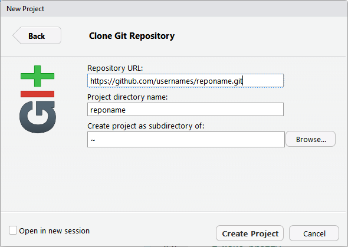

```{r setup, include = FALSE}
knitr::opts_chunk$set(echo = TRUE)
```

During the first blogdown work session we didn't do anything with blogdown and instead spent time getting Git and GitHub up and running.  Everything here is covered in more detail in [Happy Git and GitHub for the userR](http://happygitwithr.com/), I simply picked out the main bits so we could run through things together.

I spent time on Git because I think it's easiest to maintain your website materials on GitHub for continuous deployment.  I did not spend any time talking about Git and version control and why these are important but it's definitely worth [reading through that section of Happy Git](http://happygitwithr.com/big-picture.html).

This document looks fairly long, but we miraculously didn't run into any snags and the group was able to do all of this in less than an hour.

# Register GitHub account

Go to https://github.com/ and sign up.  You'll need to pick a user name that you will want to use in the long term and that you're happy to share with people. 

You will need to associate your account with an email address.  I recommend picking an email address you will have for the long-term, so consider using a personal email instead of your temporary school email.  You can change this later if needed (I did), but it is simplest to pick a long-term email from the start.


```{r, echo = FALSE, dev = "png"}
knitr::include_graphics("01_git_day_files/figure-gfm/git_start_window.PNG")
```


# Update R and RStudio to current versions

Make sure you have current versions of R and RStudio.  In spring 2018 R 3.5.0 had recently come out and had some major changes so using a slightly older version of R in the short-term was an OK approach (3.4.4 was the last version before 3.5.0).

# Install Git

## Windows

Install Git for Windows from https://gitforwindows.org/.

During installation you can use the defaults for most options.  Make sure the "Use Git from the Windows Command Prompt" is chosen when "Adjusting the PATH environment".  This was the default when I installed things, but watch for this and make sure.

```{r, echo = FALSE}

```


You should be able to find the executable in `C:/Program Files/Git/bin/git.exe`.

At the end of installation, launch Git Bash.  You don't need to review the release notes.

```{r, echo = FALSE}

```

## Mac OS

I'm putting two options here (I don't have a Mac so have never tried either `r emo::ji("stuck_out_tongue_winking_eye")` but these  are the top two recommendations in Happy Git).

1. Install Xcode.  This can be done using command line tools in the shell using `xcode-select --install`.  

2.  Install from https://git-scm.com/downloads.

# Download a Git client (optional)

You'll see that RStudio now has a basic Git client, which works well most of the time for maintaining a website made via **blogdown**.  You can also always use the shell.  

However, it's nice to have an alternative.  I use [GitKraken](https://www.gitkraken.com/), and have been happy to have it when I needed it.  There are plenty of [other options](http://happygitwithr.com/git-client.html#recommended-git-clients).

# Introduce yourself to Git in the shell

Open up a shell terminal.  In Windows the easiest thing to do is to use Git Bash.

If you want more background on the shell, see [Appendix A](http://happygitwithr.com/shell.html) in Happy Git.

You will put in a user name and an email address to be associated with Git. 

The user name can be anything you want.

The command in the shell is:

`git config --global user.name "User Name"` Put your name in place of `"User Name"`.

The user email should be the email you are using for your GitHub account.

`git config --global user.email "youremail@gmail.com"`

Check that these changes took.

`git config --global --list`

# Connect to GitHub via the shell

Now we need to make sure Git and GitHub can talk to each other and that we can make local changes and *push* them on to GitHub.

## Make a new repository on GitHub

Go to your GitHub account.  Go to the `+` drop down menu in the upper righthand corner and choose `New Repository`.

```{r, echo = FALSE}

```

1. Make a repository name.  Keep it simple.  You cannot have spaces in names but can include dashes (hyphens).  I used `test` for my first test repo, which I will delete at the end of this practice.

2. Put in a basic description (optional).

3. Choose `Public`.  (This is the default.).  All the material in the repository will be in the public domain.

4. Select `Initialize this repository with a README`.

5. Click the `Create Repository` button.

6. Once the repository is created, click the `Clone or download` button and copy the URL to the clipboard with the clipboard button.

```{r, echo = FALSE}

```

## Clone repository from GitHub onto local computer

For the first test repository, it can be simplest to put the local directory in your default directory (since we will delete it at the end of this process).

Paste the URL you copied to the clipboard.  I have to right click to "Paste" in to Git Bash on Windows 7.  Not all shells are clipboard aware, so worst-case scenario you'll need to type out the URL.

`git clone https://github.com/usernames/reponame.git`

If you want to put the repository in a specific directory, change the directory away from the default in the shell using `cd`.

You can write out the whole (absolute) file path.  

- On Windows use forward slashes.
`cd c:/Users/Owner/Documents`

- On Mac OS use backslashes.
`cd /home/my_username/Desktop`

If you have any spaces in the directory path you'll need to wrap the file path in quotes.

## Work in the local repository

The first thing to do is to change the directory to the new folder for the local repository.  The local repository will have the same name as the GitHub repository.  I'm using the place holder `reponame`.

`cd reponame`

Now interact with the repository in the shell.

- `ls` To list all the files  
- `head README.md` To see the top lines of the README file  
- `git remote show origin` To, e.g., see the URL of the associated GitHub repository

## Make a change to a local file

We'll make a local change that needs to then be pushed on to GitHub.

We can add a line of text to the README in the shell.

`echo "I'm adding a line to README" >> README.md`

Then we can check the status to see that we've edited a file locally.

`git status`

## Update GitHub with the local changes

The process for updating the remote repository in Github involves *staging*, *committing*, and *pushing*.

First, stage any changes.  Use `-A` to stage all files that have been edited.

`git add -A`

Next, commit the changes.  You need to add a commit message to say what change you've made.

`git commit -m "Local edit to README"`

Finally, push the changes to the remote repository on GitHub.  If you are new to GitHub you will be asked to enter your GitHub username and password.

`git push`

Go back to your GitHub repository and see the changes in the README!

# Connect to GitHub via RStudio

Once you know Git and GitHub are communicating, it's time to make sure we can use RStudio instead of the shell.  (You can always use the shell if that's what you are comfortable with.)

Delete the local version of the repository.  We'll make it again via RStudio.

## Start new Project

In RStudio, go to `File > New Project...`

Select `Version Control`

```{r, echo = FALSE}
knitr::include_graphics("01_git_day_files/figure-gfm/rstudio_vcontrol.PNG")
```

And then `Git`

```{r, echo = FALSE}
knitr::include_graphics("01_git_day_files/figure-gfm/rstudio_git.PNG")
```

Paste the cloned URL from the remote repository.  You can browse to choose a directory for the local repository if you want to save it somewhere specific.

```{r, echo = FALSE}

```

The remote files will be downloaded into the new folder and the new Project will open.  You will have a `Git` tab in your "Environment" Pane in RStudio.

```{r, echo = FALSE}
knitr::include_graphics("01_git_day_files/figure-gfm/rstudio_gittab.PNG")
```

**If you cannot make a version control project**

If your RStudio version is up-to-date but you don't have the option to make a "version control" Project then you have some sort of problem with Git and RStudio.  This is (apparently) more likely to happen on Windows.

The best-case scenario is that you need to tell RStudio where to find Git.

Go to `Tools > Global Options...` and then choose `Git/SVN`.

Make sure the path to the Git Executable is `C:/Program Files/Git/bin/git.exe`.  Notice it must be in `bin` and not `cmd`.  If not, change the path to the correct one, push `OK`, restart RStudio, and try the version control Project again.

See [Chapter 14](http://happygitwithr.com/rstudio-see-git.html) of Happy Git for more detailed information.

```{r, echo = FALSE}
knitr::include_graphics("01_git_day_files/figure-gfm/rstudio_findgit.PNG")
```

## Edit local version of README

Once the project opens, open `README.md` and add some text.

## Update GitHub with the local changes

In the `Git` tab in RStudio, stage the README file by clicking on the box next to it.

Select `Commit` in the `Git` tab, write a message in the "Commit message" box in the pop-up window that opens, and then hit the `Commit` button.

Finally, `Push` to the remote repository.  You will be asked for your username and password.


```{r, echo = FALSE}

```

Go back to your GitHub repository to see the changes.

## Troubleshooting

Did it work?  Yay!

Did something fail?  Bummer.  Something is wrong.  Go to Chapter 15 of Happy Git, [RStudio, Git, and GitHub hell](http://happygitwithr.com/troubleshooting.html) to try to solve the problem.

# Clean up

Since this particular repository was simply for testing, you can delete it locally and remotely.

Go to the respository page on GitHub and then go to `Settings`.  Scroll down to the very bottom until you see the `Delete this repository` button.  Push it and follow the instructions.

# Adding SSH key for authentication

Once you start making a fair number of changes, it is a pain to have to enter your GitHub credentials every time you want to push.  I think the easiest thing to do is to add a SSH key in RStudio.

## Set up SSH key pair in RStudio

RStudio makes it pretty easy to do this.  You can (add likely should) add a passphrase for this, but I am skipping that step here.

In RStudio, go to `Tools > Global Options... > Git/SVN`.

Click on `Create RSA key`.  RStudio will generate and store the keys for you.

## Add key to ssh-agent via shell

Open a shell to tell the ssh-agent about the key RStudio made.

First return the agent info.

- On Windows: `eval $(ssh-agent -s)`

- On Mac OS: `eval "$(ssh-agent -s)"`

Then add the key via `ssh-add`.  

- On Windows I had to write out the whole directory path.  RStudio stores the key pair in your `Users` folder so that is the path I had to write out (my user folder is `muldoona`). `ssh-add c:/Users/muldoona/.ssh/id_rsa`

- On Mac you may be able to write things out with a relative file path.  I haven't tried it.  `ssh-add ~/.ssh/id_rsa`

## Copy public key to clipboard

Now go back to RStudio `Tools > Global Options... > Git/SVN`.

Click on the blue `View public key` and then copy the key from the pop-up window.

```{r, echo = FALSE}
knitr::include_graphics("01_git_day_files/figure-gfm/copy_sshkey.PNG")
```

## Paste the key to GitHub

Go to your GitHub repository.  Choose `Settings` under the drop-down menu in the upper righthand corner.  Then go to `SSH & GPG keys` and click `New SSH key`.

Give the key a name and then paste the key you copied from RStudio as is and then click `Add SSH key`.  

You should now be able to push and pull from GitHub without having to authenticate each time.