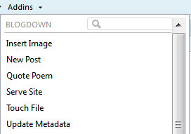

```{r setup, include=FALSE}
knitr::opts_chunk$set(echo = TRUE)
```

In our second work session the goal was to install blogdown and Hugo and then get started on making a website!  A good portion of this session was spent on starting to personalize our new website. 

All of this information (and much more!) can be found in the book [blogdown: Creating Websites with R Markdown](https://bookdown.org/yihui/blogdown/).  Alison Hill's post [Up and running with blogdown](https://alison.rbind.io/post/up-and-running-with-blogdown/) is a good blueprint, which I basically followed for this work session.

# Install blogdown

The very first step is to install the **blogdown** package in R/RStudio.

# Install Hugo

Once **blogdown** is installed, we need to install the static site generator Hugo.  The code you write in the Console will look like:
`blogdown::install_hugo()`

# Make a GitHub repository for your website

The materials for the website will be maintained on a GitHub repository, which you can then use to deploy your website.    

Create a new GitHub repository, give it a name that you will associate with your website, and add a `README` file (but not a `.gitignore` file).  Copy the repository URL and clone it into a local directory by making a new version control Project in RStudio.  Refer to [first session notes](https://github.com/aosmith16/getting-started-blogdown/blob/master/01_git_day.Rmd#start-new-version-control-project) for a reminder of how to do this.

## Edit .gitignore

Once you have a local copy of the directory, edit the `.gitignore` file.  Make sure it contains
`.Rproj.user`
`.Rhistory`
`.RData`
`.Ruserdata`
`blogdown`
`public/` *This one is very important*
`.DS_Store` *Include for Mac only*
`Thumbs.db` *Include for Windows only*

# Pick a website theme

Before coming to the session I asked students to choose a theme for their website.  The "theme" is generally how the website looks and works, and we can make our website off of themes someone else has already created.  The blogdown package uses Hugo as the static site generator, and there are a wide variety of Hugo themes.  See the complete list at https://themes.gohugo.io/ or check out a few recommendations from the [blogdown book](https://bookdown.org/yihui/blogdown/themes.html).

When you open a theme you will have the option to `Demo` the theme, which can help you figure out if you like it or not.

Since everyone's goal was to have a personal website to showcase their academic and professional credentials and not necessarily to start blogging, we decided that as a group we would all use the [Hugo Academic theme](https://themes.gohugo.io/academic/).

# Create a website with the chosen theme

Once you've picked a theme, you can create a new site within your RStudio project.  You'll need to know the name of the repository that theme is stored at.  You can generally see this if you hover over the `Download` button when looking at the theme page.

Here is example code for making a new site with the Hugo Academic theme:
`blogdown::new_site(theme = "gcushen/hugo-academic", theme_example = TRUE)`

It is customary to add the `theme_example` so you have examples to work off of.  This makes it easy to add your own documents.  By the time you are ready to deploy your website, you will have deleted the extraneous files and/or replaced the information in them with your own.

When you run the `new_site()` code you will see some messages and then you will see a bunch of new files in your local repository for the theme.

# Change the website theme

If you make a website and then later decide you want to change the theme you can do so.  I initially used [Future Imperfect](https://themes.gohugo.io/future-imperfect/) for [my blog](https://aosmith.rbind.io/) but then ran into things I didn't like so switched to [Tranquilpeak](https://themes.gohugo.io/hugo-tranquilpeak-theme/).  Just try to be careful not to make too many changes to a theme before you decide to switch; tweaking themes can take a lot of time if you're not careful! :laughing:

To change the theme after you've made a site:
`blogdown::install_theme(theme = "gcushen/hugo-academic", theme_example = TRUE, update_config = TRUE)`

# Edit the Project options

Per the blogdown book, it is recommended that [you change your Project Options](https://bookdown.org/yihui/blogdown/rstudio-ide.html#fig:project-options).

In RStudio, with your project open, go to `Tools > Project Options...` and then down to `Build Tools`.  Unclick the two boxes next to `Preview site after building` and `Re-knit current preview when supporting files change`.

# Personalizing your website

Now you're ready to start personalizing the website!  

## Pictures

You should choose any pictures that you want for your profile picture or background pictures (depending on the theme).  These pictures need to be stored in the `static` folder.  Many Hugo themes (including Academic) will already have a folder called `img` (or something similar) in the `static` folder.  Put your pictures in there.  

If you need to write out the file path to a picture you will do it *relative* to the static folder, as it is assumed your static files are in that folder.  For example, I have a relative file path that looks like `/img/main/ao_ppg2.jpg`, where "main" is a subdirectory in "img" which is a directory in my `static` folder.

## Edit config.toml

The first thing to work on to personalize the website is change the configuration by editing the `config.toml` file.  You will want to change everything that is about the person in the theme example to be about you instead. 

Most of the `config.toml` files I've seen for a variety of Hugo themes have a lot of annotations to help you figure out what to change and how to change it.  You can often leave something out by putting in a blank with `""`.  Otherwise some things may take some trial and error; you can always add things back in if something weird happens to your site.

Hugo Academic is a pretty complicated theme, and it has some helpful [start-up docs](https://sourcethemes.com/academic/docs/) to get you started.  See the [Getting started](https://sourcethemes.com/academic/docs/get-started/) section for some basic things to change in `config.toml`.

Here are a couple of things to start with:

Make sure that you have a line in the first section says `ignoreFiles = ["\\.Rmd$", "\\.Rmarkdown$", "_files$", "_cache$"]`.  Your theme may come with this pre-filled in.

Before you deploy your website, make sure your `baseurl` ends with `/`.  Generally you will see `baseurl = https://example.com/` or simply `baseurl = "/"`.

# Serve the site

To preview a local copy of the website in RStudio you need to serve the site.  You can do this manually with `blogdown::serve_site()` or use the `Addins` menu in RStudio to choose `Serve Site` from the blogdown section.



I often have to serve the site and then make and save a change from a file before I can see any of the changes I made.  This likely depends on your operating system.

# Push changes to GitHub

Once you've made all the changes you want or are finished for the day you'll want to commit and push the changes to the GitHub repository.

The first stage-commit-push will involve a lot of files, since there are so many files associated with the theme.  **If you are on a Windows machine** you may have problems with staging all the files if you try to do this within RStudio.  What I usually see is that RStudio freezes and the eventually have to force a restart.  See the conversation [here](https://community.rstudio.com/t/blogdown-unable-to-stage-and-commit/6621) for more info.

To be on the safe side, I'd recommend you stage either via the shell or via your alternative Git client.  You can open up a shell in RStudio by going to `Tools > Shell...` or simply go to the `Terminal` pane (next to the `Console`) and stage via `git add -A`.  Once things are staged I haven't had any problems committing or pushing.
