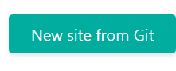
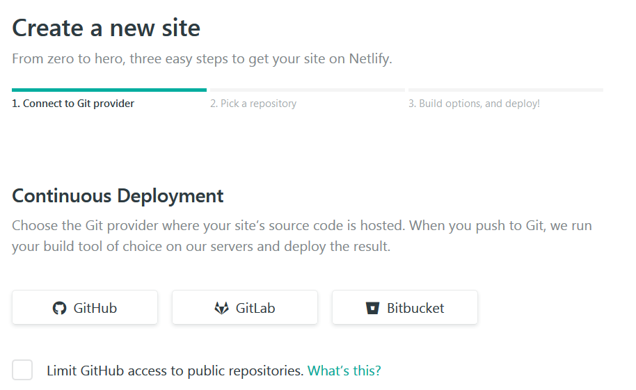
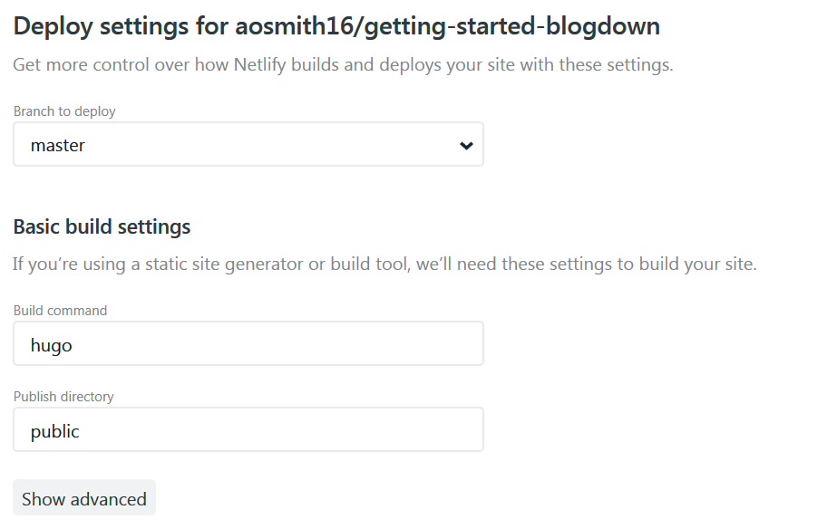
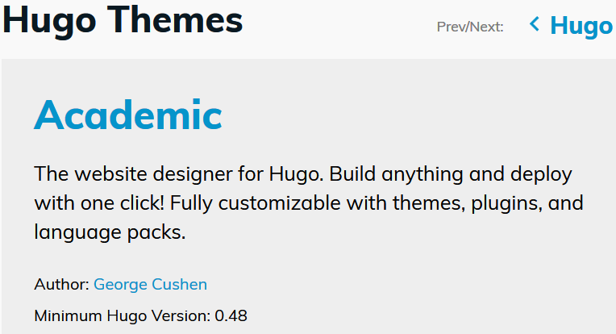
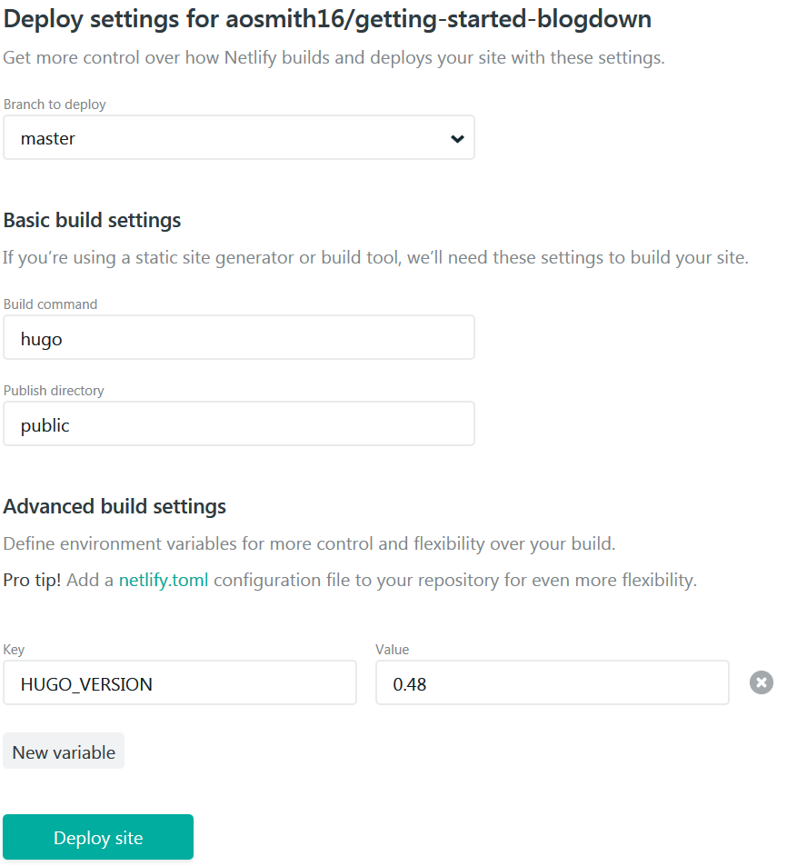
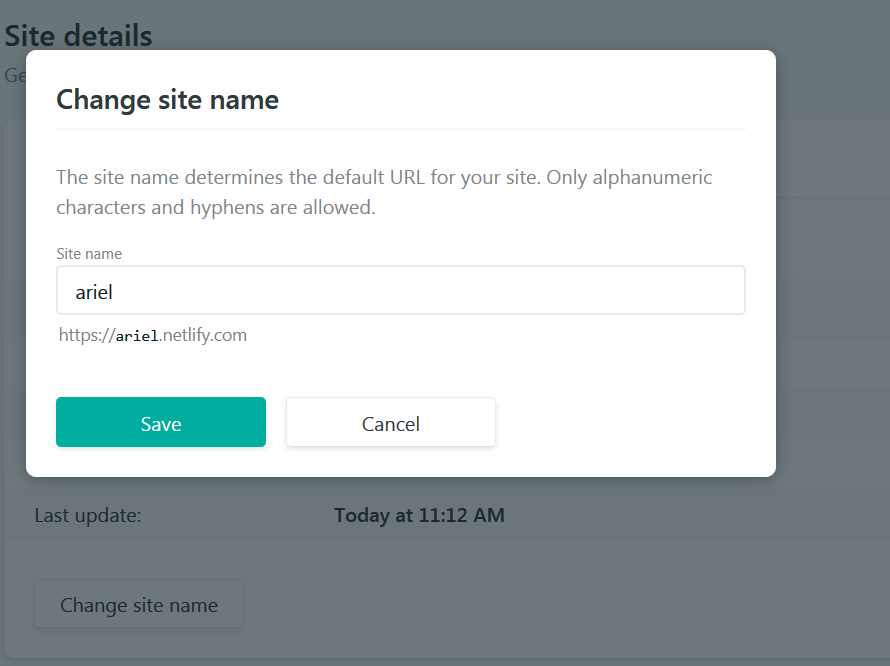

Sessions 3 and 4 - Deploying website
================
Ariel Muldoon
May 21, 2018

The last topic we discussed was deploying the website, since the goal of
making a website was to have it online. :smile:

I wanted to cover this topic so folks would be able to do it once their
website was ready. However, we ran into some problems with actually
doing this since most people hadn’t edited all their website material
and we got deployment error messages. This was a good thing in the long
run, because we were able to see that the deployment error messages were
useful and pointed to the documents that were having problems. These
could then be edited or removed, and deployment was successful.

Since we got hung up on deployment we met one additional time, where we
discussed custom domain names and then some other miscellaneous
information like setting blogdown options in your `.RProfile`. I’ll
include that all here, as well, rather than making separate document,
since it should all fit in one work session.

Like session 2, everything here is well covered in the [blogdown
book](https://bookdown.org/yihui/blogdown/) and the deployment section
of Alison Hill’s [blogdown
post](https://alison.rbind.io/post/up-and-running-with-blogdown/#deploy-in-netlify).

# Deploying your website with Netlify

[Netlify](https://www.netlify.com/) is an easy way to deploy a website
(but see other options in the
[chapter 3](https://bookdown.org/yihui/blogdown/deployment.html) of the
blogdown book). I found it especially straightforward when things are
set up to store your materials on a GitHub repository from the start.
That whole first “Git Day” pain is really worth it\!

Make sure you’ve pushed all your local changes before you start to see
the most current version of your website. However, since we will be
working on a continuously deployed website, any new materials you push
to GitHub will automatically be deployed.

## Sign up with GitHub

Sign up with Netlify using your GitHub account. This is convenient for
deploying the website directly from materials in a GitHub repository.

## Make a new site on Netlify

Once you are logged in to Netlify, click the `New site from Git` button
to start making a new site.

Then choose `GitHub` under the `Continuous Deployment` section.

You will then see your GitHub repositories. Choose the one that contains
your website materials.

## Basic build settings

Once you choose your repository you will see your `Deploy settings`.

The `Branch to deploy` will be `master`.

In the `Basic build settings`:

Make sure the `Build command` is `hugo`.

Make sure the `Publish directory` is `public`.

## Set Hugo version to use for your website

The next step is to set the Hugo version that Netlify will use to build
your website.

There are many versions of Hugo. You need to make sure you use a version
in Netlify that will work with your theme.

You can find the minimum Hugo version needed for a particular theme at
the Hugo Theme description site. We looked at the Hugo themes and their
descriptions in the last session at <https://themes.gohugo.io/>.

For Hugo Academic you will need a relatively up-to-date version of Hugo.

Netlify defaults to using Hugo version 0.17. If you need a version of
0.20 or later you will need to create an environment variable.

Click on the `Show advanced` in the Deploy settings and then `New
variable`.

In the `Key` field enter `HUGO_VERSION`.

In the `Value` field enter the Hugo version, which should be at least
the minimum version your theme needs.

Then click `Deploy site`\!

If all goes well, your site will deploy and you will be given a website
name.

# Troubleshooting deployment problems

If your site doesn’t deploy, you will be able to look through the
deployment log for errors.

In Netlify, go to your website and then to `Production deploys`. Click
on the last deploy and scroll down the the `Deploy log`. It might be
very long and look like it’s filled with gobbledy-gook, but as you look
through it you should see some error messages. Those are your clues to
what files are causing problems.

For the people in the work session, multiple people had problems where
they were supposed to enter a date in `config.toml` but used text
instead. In addition, there were some problem documents from the theme
example that were causing problems. The deploy log helped us track all
of these things down. When you think things are fixed you can `Trigger
deploy` to try deploying again.

# Changing your website name in Netlify

Netlify will assign you some long, possibly humorous name. You will
likely want to change this to something that is going to be easier to
remember.

Go to your website in Netlify and then go to `Site settings`. You will
be able to see your `Site details` there, with an option to `Change site
name`.

# Using a custom domain

You can keep the the site at `netlify.com` or use a custom domain.
Custom domains can (apparently) be purchased at a relatively low cost.
Alternatively,
[Rbind](https://support.rbind.io/2017/04/24/launching-rbind-support/)
offers custom domains at `*.rbind.io`. You can request one at their
[GitHub repository](https://github.com/rbind/support/issues).

If you get a custom domain, you can add this in your `Site settings`
under `Domain management`.

# Updating the base URL in `config.toml`

Once you have your website name picked out and the website is running,
you need to go back to your `config.toml` and replace the placeholder
`baseurl` with the real thing. Make sure the URL you enter ends with `/`
still.

For example, my blog `config.toml` has  
`baseurl = "https://aosmith.rbind.io/"`

# Miscellaneous topics

## LiveReload in blogdown

On the last day we talked about a few extra miscellaneous details, based
on problems I’d run into. On my (relatively old) Windows machines, I had
some problems with RStudio crashing when I served the site locally. I
switched to setting the option `blogdown.generator.server = TRUE`, which
helped. You can read about this in the blogdown book in [section
D.2](https://bookdown.org/yihui/blogdown/livereload.html#livereload).

## Setting options in .RProfile

The above option and others can be set to the defaults by adding them to
your `.RProfile`. In addition to the server option, I have the default
blog post type set as `.Rmd` in my `.RProfile`.

You can do this in R with  
`file.edit("~/.RProfile")`

and then entering the options you want into that file. These are the
options I have in mine:

    options(blogdown.author = "Ariel Muldoon",
            blogdown.ext = ".Rmd",
            blogdown.subdir = "post",
            blogdown.generator.server = TRUE,
            blogdown.hugo.server = c("-D", "-F", "--navigateToChanged"))

## Making changes to your website

It can be hard to figure out all the changes you want to make in your
website or the changes you are going to do will “break” anything.

One approach to take is to look at other people’s website materials.
When I started working on my Academic-theme website for these work
sessions, I looked at the GitHub repositories for Alison Hill’s and
Frank Harrell’s websites, since I could tell they were made using the
Academic theme and I wanted to use some of the features they used.

Visiting these websites is what helped me get a clearer picture of
things I could delete and how I might want to change things. I deleted
`heroes.md` to get rid of the site picture header as well as
`publications-selected.md`. I wasn’t happy with how the publications
looked on my site and so ended up making some changes to the theme
layout materials based on what I saw on other sites.

Do recognize that these things can take a lot of time, and when you are
getting started it’s perfectly OK to use the defaults until you have
time to tweak things.:upside\_down\_face:

## Advertising your website

One thing you will notice after you have your website up and going: it
doesn’t come up in searches. I don’t know too much about this, but it
looks like there are some things you can do to help your website come up
when your name is searched.

  - Have your name as part of the URL
  - Use your name as the title of your website
  - Put a link to your website on all your social media accounts  
  - Wait. Sometimes things takes time. :wink:

My second website, made during the working sessions, is at
<https://ariel.rbind.io/> and is now the first hit when I Google my
name. This is the case even though I use the my blogging website,
<https://aosmith.rbind.io/>, much more and I made it first. This is
likely because my blog is titled “Very Statisticious” instead of being
titled with my name. Interestingly, the GitHub repository for my blog
(not the blog itself) is the ~5th hit, so the blog can still be found.
